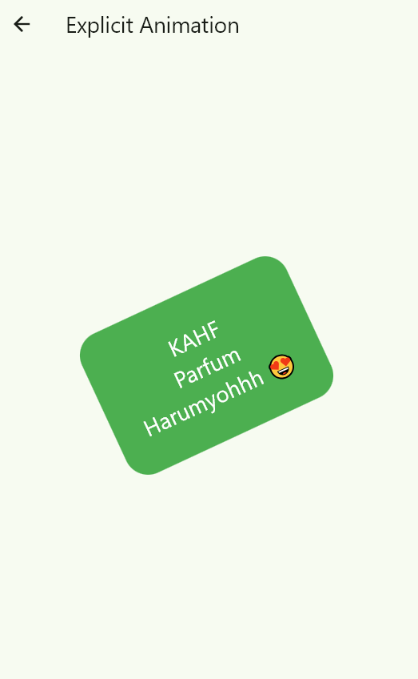
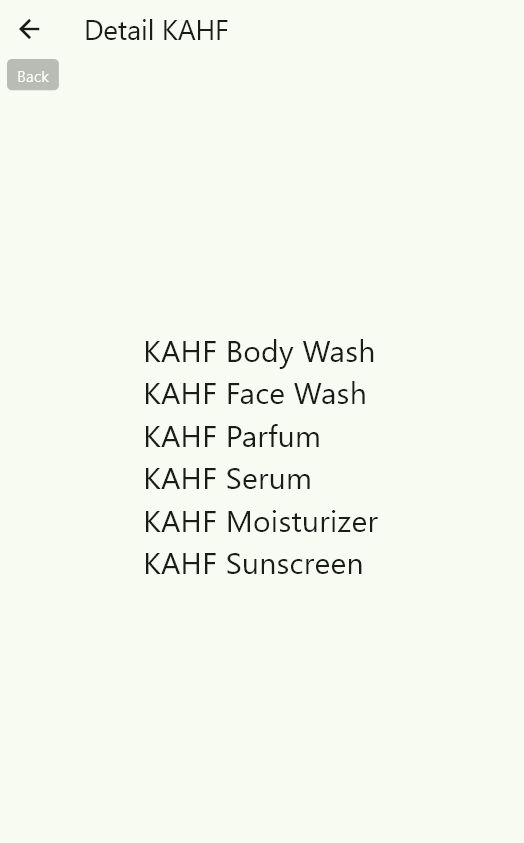

# 📱 KAHF Animation & Transition App (Flutter)

  
  
  
  

  
  
  

## 👤 Identitas

**Mata Kuliah** : Pemrograman Mobile 2  
**Topik** : Animation & Transition  
**Platform** : Flutter  
**Tema Aplikasi** : Produk KAHF  

---

## 📌 Deskripsi Aplikasi

Aplikasi **KAHF Animation & Transition App** merupakan aplikasi Flutter sederhana yang dibuat untuk menerapkan berbagai konsep animasi dan transisi halaman.  
Aplikasi ini mengangkat tema **produk KAHF** dengan tampilan UI/UX modern, clean, dan interaktif.

Aplikasi ini bertujuan agar mahasiswa memahami dan mampu mengimplementasikan:

- Animasi implicit  
- Animasi explicit  
- AnimationController & Tween  
- AnimatedBuilder  
- Transisi halaman (Page Transition)  
- Animasi interaktif (Interactive Animation)  
